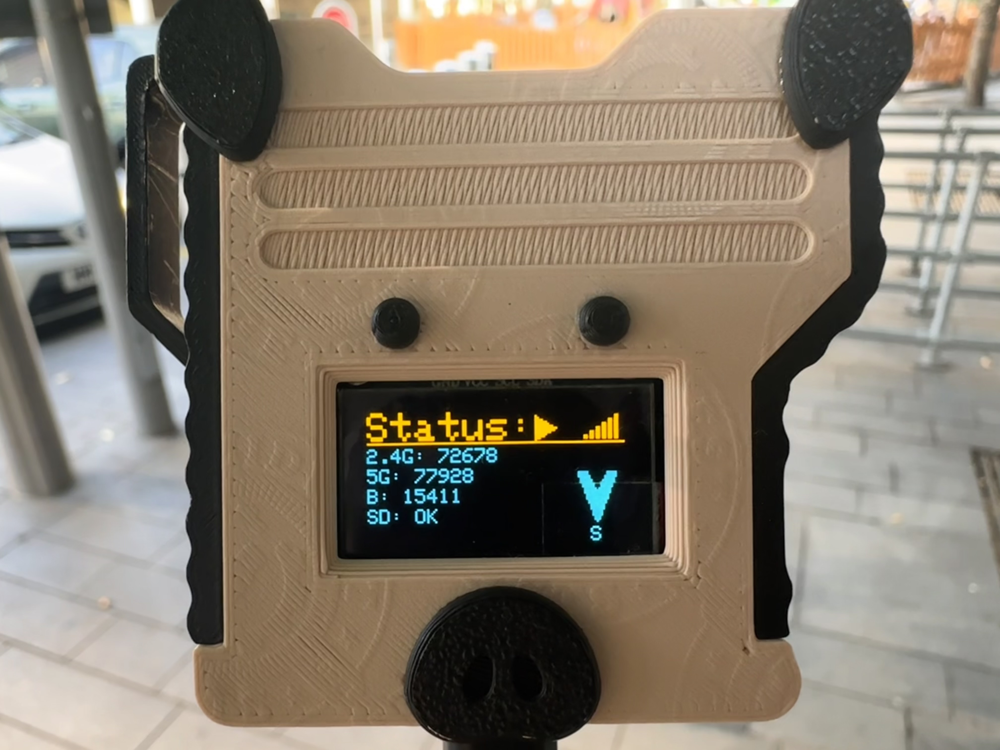
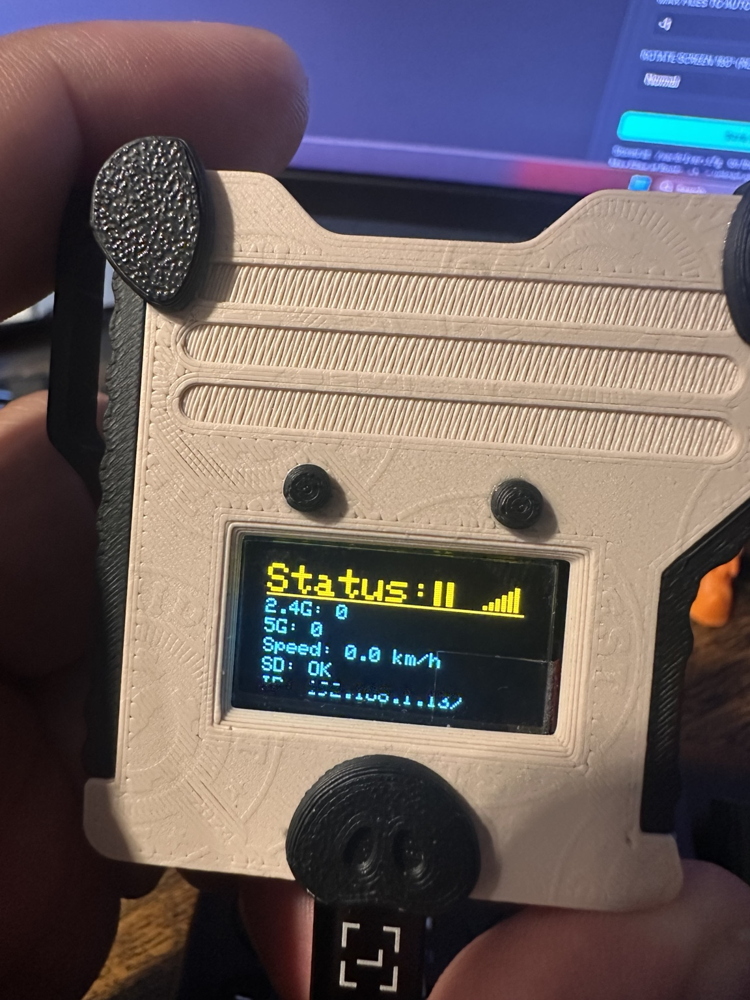
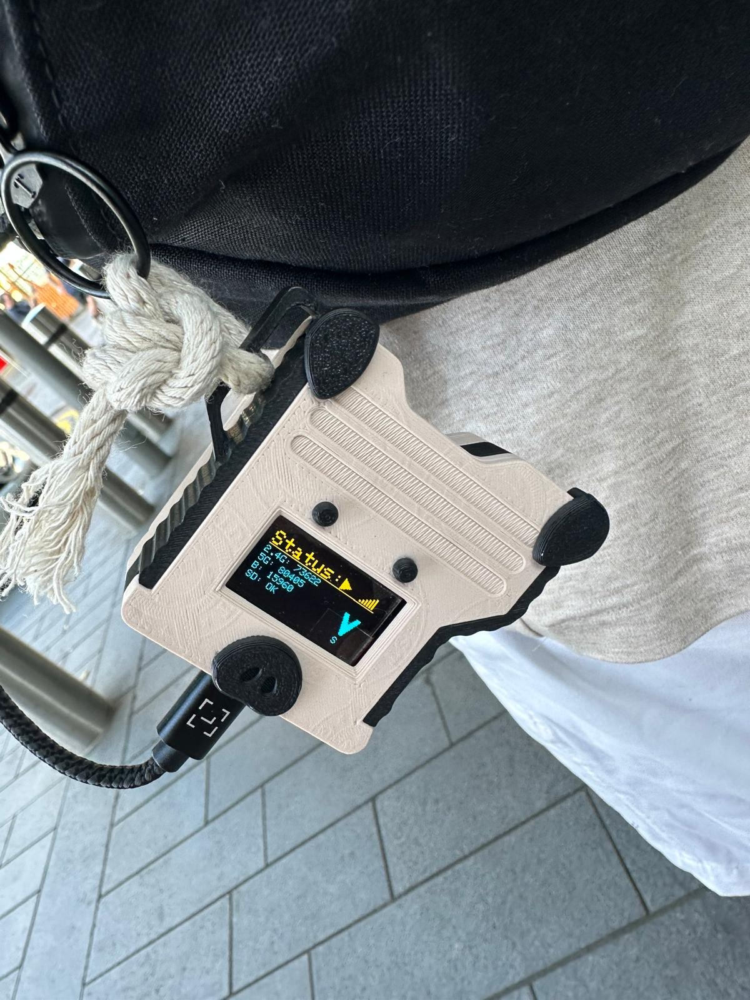

# Piglet KG Edition

**Piglet KG Edition v1.0.0** — a field-tested ESP32-C5 wardriver based on
Piglet v2.58. 🐷📡

<p align="center">
  
</p>

<p align="center"><em>Piglet KG Edition — field-tested XIAO ESP32-C5 wardriver.</em></p>

Piglet KG Edition is a direct fork of the original
[Hamspiced/piglet](https://github.com/Hamspiced/piglet) project. It keeps the
spirit and compatibility of upstream Piglet while adding small, reviewable KG
improvements for mobile wardriving, GPS resilience, dual-band ESP32-C5 scanning,
BLE visibility, WebUI control, and practical SD/upload maintenance.

The primary KG hardware target is the
[Seeed Studio XIAO ESP32-C5](https://www.seeedstudio.com/Seeed-Studio-XIAO-ESP32C5-p-6609.html).
KG Edition is not intended to replace upstream Piglet; it is a KG-focused
edition developed through incremental real-hardware testing.

Current KG development is unified on `main`.

Original Piglet upstream: [Hamspiced/piglet](https://github.com/Hamspiced/piglet)

## KG Edition Status

✅ **v1.0.0 is the first stable KG Edition baseline.** It is centered on the
Seeed Studio XIAO ESP32-C5 and reflects the current hardware-tested field build.
Validation is called out where it is specific to the real KG device; other
implemented source features are labelled carefully.

## v1.0.0 Feature Overview

- ✅ Seeed Studio XIAO ESP32-C5 primary KG target
- ✅ Dual-band 2.4 GHz / 5 GHz Wi-Fi scanning on ESP32-C5
- ✅ KG Recommended scanning profile
- ✅ Custom 2.4 GHz / 5 GHz channel and dwell control
- ✅ Passive BLE scanning interleaved with Wi-Fi
- ✅ Dynamic BLE dedupe with no fixed device-count limit
- ✅ Configurable GPS cache, including KG `720`-minute field configuration
- ✅ Startup GPS Backfill for pre-first-fix Wi-Fi/BLE detections
- ✅ WiGLE-compatible CSV output
- ✅ WDGoWars and WiGLE upload support
- ✅ Service-aware credential gating for blank/unconfigured upload services
- ✅ OLED and WebUI controls, including BLE unique count visibility
- ✅ Stop/Start pause/resume semantics for the active session
- ✅ 100,000-row CSV rotation
- ✅ Mini Reset / Crash History
- ✅ Uploaded Log Retention
- 🧪 Mesh Core/Node support is implemented in source and available for further
  field validation

KG Recommended is the current default profile for this fork:

- 2.4 GHz: `1,6,11` at `110 ms`
- 5 GHz: `36,40,44,48` at `100 ms`
- BLE: passive `1000 ms` scan after every `5` completed Wi-Fi cycles

This validates the tested configuration above. It does not claim that every
possible custom channel, dwell, BLE timing, route speed, or RF environment has
been hardware tested.

🐷 Original Piglet all-channel Wi-Fi scanning remains selectable as a
compatibility profile.

Profile meanings in WebUI:

- 🐷 Original Piglet: upstream-style Wi-Fi scanning, KG BLE disabled
- 🔥 KG Recommended: default for fresh/legacy configs, hardware-tested KG Wi-Fi
  profile, BLE enabled on profile selection, fixed BLE timing `1000 ms` /
  every `5` Wi-Fi cycles
- 🛠️ Custom: explicitly user-selected manual Wi-Fi and BLE tuning. Custom is
  never selected automatically just because values match or differ. Entering
  Custom from a preset opens a clean manual setup; saved Custom settings are
  restored after reboot.

## KG Quick Start

Use the hardware-tested XIAO ESP32-C5 KG Recommended scan profile:

```ini
scanProfile=kg
wifi24Channels=1,6,11
wifi5Channels=36,40,44,48
wifi24DwellMs=110
wifi5DwellMs=100
bleEnabled=true
bleScanDurationMs=1000
bleEveryNCycles=5
```

For the current KG GPS field-testing configuration:

```ini
gpsCacheMinutes=720
```

This keeps the last valid GPS coordinates available for up to 720 minutes
(12 hours) after the current GPS fix is lost. This is a KG Edition
recommendation, not an upstream Piglet default.

Important GPS notes:

- Default GPS cache: `3` minutes
- Supported range: `1..10080` minutes
- `gpsCacheMinutes=720` is separate from `scanProfile=kg`; selecting KG
  Recommended does not automatically change the GPS cache
- Long cache windows improve continuity during temporary GPS loss, but can
  attach stale coordinates if the device moves too far before regaining a fix

For upload services, leave a credential empty to disable that service:

```ini
wigleBasicToken=
wdgwarsApiKey=
```

Uploaded CSV retention is enabled by default:

```ini
autoDeleteUploadedLogs=true
uploadedLogsToKeep=10
```

Instructional token/key text belongs in comments or WebUI placeholder text, not
as an active credential value. Recognized legacy instructional credential values
are treated as unconfigured at runtime.

These BLE values work on the project XIAO ESP32-C5 and are the fixed BLE timing
used by the WebUI `KG Recommended` scanning profile when BLE is enabled. BLE can
still be disabled by the user while KG Recommended remains selected. This is a
hardware-tested starting profile, not a claim of universal optimum.

## Scan Profiles

Piglet KG Edition uses explicit scan-profile identity:

- `scanProfile=kg` - KG Recommended XIAO ESP32-C5 field-tested starting profile
  and current default for this fork
- `scanProfile=original` - Original Piglet compatibility mode with upstream-style
  all-channel Wi-Fi scanning
- `scanProfile=custom` - manual channel, dwell, and BLE timing values from
  `wardriver.cfg`

Profile identity comes from `scanProfile`. Select the intended profile
explicitly with that key.

KG Recommended is a hardware-tested starting point, not a universal best setting
for every region, antenna, enclosure, route speed, or RF environment.

## KG Edition Changes

### 📍 Startup GPS Backfill — Hardware Validated ✅

KG Edition now handles the awkward GPS startup gap without stopping the scan.
Piglet starts Wi-Fi and BLE scanning immediately, even before the GPS has
acquired its first accepted fix, but it does not intentionally write those
startup detections to the final WiGLE CSV as `0.000000,0.000000`.

Before the first quality-approved GPS fix, startup detections are temporarily
retained on SD in an internal pending store. This applies to both Wi-Fi and BLE.
When the first accepted GPS fix arrives, Piglet freezes one immutable GPS
snapshot containing latitude, longitude, altitude, and accuracy. Any Wi-Fi/BLE
work already in flight is allowed to finish cleanly, then all startup detections
are replayed with that same first-fix GPS snapshot.

Each replayed detection keeps its original `FirstSeen` timestamp and original
radio metadata. After replay completes, normal live GPS logging resumes. If GPS
is later lost, the existing configurable GPS cache takes over. The current KG
field-testing configuration can use:

```ini
gpsCacheMinutes=720
```

In short: Startup GPS Backfill solves the **before-first-fix** gap. The
720-minute GPS cache solves GPS loss **after** a valid fix has already existed.

Real XIAO ESP32-C5 validation:

- Previous behavior in the tested log: `194` startup detections without GPS
  coordinates (`170` Wi-Fi, `24` BLE).
- Fixed build: `0` startup `0,0` rows in the validated CSV.
- Wi-Fi and BLE startup records were both successfully backfilled.
- Original `FirstSeen` values were preserved.
- Normal live GPS coordinates resumed after replay.

This is hardware validated on the project XIAO ESP32-C5. It is not a guarantee
that every environment or hardware setup behaves perfectly.

Intentional tradeoff: all pre-first-fix startup detections receive the same
first valid GPS snapshot. If the device moves significantly before acquiring
that first fix, those startup detections are geographically approximate and are
assigned to the first-fix position. This is deliberate and preferred over
discarding detections, waiting to scan, or writing `0,0` coordinates.

Startup pending data belongs only to the current boot. If the device never gets
a valid GPS fix and is rebooted or powered off, stale startup pending data from
the previous boot is discarded rather than assigned to a potentially unrelated
location later.

### Configurable GPS cache timeout

KG Edition adds configurable reuse of the last valid GPS coordinates after the
current GPS fix is lost.

Configuration key:

```ini
gpsCacheMinutes=3
```

- Default: `3` minutes
- KG recommended configuration: `gpsCacheMinutes=720`
- `720` minutes = 12 hours
- Valid range: `1..10080` minutes
- If the current GPS fix is lost, Piglet may continue using the last valid GPS
  coordinates for the configured duration.
- When the configured cache expires, normal no-fix GPS behavior resumes.
- Configurations without `gpsCacheMinutes` retain the original 3-minute
  behavior.

Long GPS cache periods can associate detections with an older location if the
device continues moving while GPS remains unavailable.

Real field note: during one XIAO ESP32-C5 mobile test the device spent roughly
15:10 to 16:12 in the London Underground / metro environment, where normal GNSS
reception was not realistically available. With the long configured GPS cache,
scanning and logging continued, and the inspected logs did not contain `0,0`
coordinate rows. This validates scanning/logging continuity during GPS loss; it
does not mean Piglet reconstructed the true underground route. Cached
last-known coordinates may become geographically stale while the device keeps
moving without a fresh fix.

### Service-aware boot uploads — WDGoWars-only Hardware Validated ✅

WiGLE and WDGoWars are independently configured upload services. An empty
credential disables that service, and known legacy instructional credential
placeholders are treated as unconfigured. An unconfigured service performs no
intentional upload-network work: no DNS lookup, TLS connection, HTTP request, or
upload retry for that service.

`maxBootUploads` controls how many eligible pending CSV files the boot uploader
may process, but it does not enable an otherwise unconfigured service. With
WDGoWars configured and WiGLE empty, Piglet uploads only to WDGoWars. That
WDGoWars-only boot path was physically validated on the real XIAO ESP32-C5:
after WDGoWars upload completion, `autoStartAfterUpload` transitioned directly
into normal wardriving without waiting on WiGLE.

Existing dual-service support remains when both services are configured. The
WiGLE-only and dual-service combinations are source-audited here, but are not
claimed as hardware validated by this note.

### Manual upload behavior caveat

The historically named WebUI WiGLE **Upload All CSVs** action still uses the
older combined batch path. When both upload services are configured, that path
can process WDGoWars first and WiGLE second, even though the button is
WiGLE-oriented. Service gating still prevents an unconfigured service from doing
network work.

### Configurable scanning profiles and dwell

KG Edition adds explicit solo scanning profiles, custom 2.4 GHz / 5 GHz channel
lists, a per-channel asynchronous scheduler for custom profiles, and separate
dwell settings for 2.4 GHz and 5 GHz.

Configuration keys:

```ini
scanProfile=kg
wifi24Channels=
wifi5Channels=
wifi24DwellMs=
wifi5DwellMs=
bleEnabled=true
bleScanDurationMs=1000
bleEveryNCycles=5
```

Available profile modes:

- `scanProfile=original` - upstream-style all-channel Wi-Fi scanning with KG BLE
  disabled
- `scanProfile=kg` - KG Recommended XIAO ESP32-C5 field-tested profile and
  current default for this fork
- `scanProfile=custom` - explicitly user-selected manual Wi-Fi and BLE tuning

Profile identity is explicit. Custom is not selected automatically just because
values match or differ, and Original Piglet mode requires
`scanProfile=original`.

- `wifi24Channels` accepts 2.4 GHz channels `1..14`.
- `wifi5Channels` accepts supported 5 GHz channels on ESP32-C5.
- `wifi24DwellMs` and `wifi5DwellMs` apply only to the custom per-channel
  scheduler.
- Dwell range is `20..1500` ms.
- Empty or `0` dwell values fall back to the existing `scanMode` dwell timing.
- `20 ms` dwell is accepted but experimental.
- The KG Recommended WebUI profile writes `1,6,11` / `36,40,44,48` with
  `110 ms` / `100 ms` dwell, plus BLE timing `1000 ms` / every `5` Wi-Fi
  cycles when BLE is enabled.
- BLE can be disabled by the user while KG Recommended remains selected.

### Passive BLE scanning and dynamic dedupe

KG Edition adds passive BLE scanning interleaved with Wi-Fi scanning. Wi-Fi
remains the primary scanner.

With KG Recommended timing enabled, Piglet runs a passive `1000 ms` BLE scan
after every `5` completed Wi-Fi scan cycles.

BLE devices are written to the same Wigle CSV with:

- `Type=BLE`
- `Channel=0`
- `Frequency=0`

`Channel=0` and `Frequency=0` are intentional for BLE rows; they are not Wi-Fi
channel/frequency values.

BLE unique-device tracking uses a dynamic in-memory dedupe table:

- Compact `uint64_t` identity keys
- Dynamic open-addressing hash table
- Starts small and grows as needed
- No fixed device-count limit
- Practical capacity depends on available ESP32-C5 heap

The old fixed BLE dedupe ceiling has been removed. A later real mobile XIAO
ESP32-C5 field session recorded `754` BLE rows representing `754` unique BLE
identities, with no duplicate BLE rows by MAC in that CSV. This provides
substantially stronger hardware validation beyond the former fixed `200`-device
ceiling without claiming that `754` is a maximum.

If the ESP32 cannot allocate memory to grow BLE tracking, Piglet enters a
degraded BLE tracking state. BLE logging continues, the exact unique count
freezes at the last safely tracked value, and diagnostics expose the degraded
state.

### OLED and WebUI BLE status

<p align="center">
  
</p>

<p align="center"><em>Everything important at a glance — no phone required.</em></p>

When BLE is enabled, the existing OLED Speed row is replaced with the live BLE
unique count:

```text
B:<unique>
```

Example:

```text
B:45
```

`B` means exact unique BLE devices in the current boot/wardrive session during
normal non-degraded operation.

When BLE is disabled, the OLED returns to the original Speed display.

The WebUI status area shows the same session BLE count in the BLE status pill:

- `BLE: OFF`
- `BLE: READY · B:<count>`
- `BLE: SCANNING · B:<count>`
- `BLE: DEGRADED · B:<count>`

The main WebUI counter row shows:

```text
2.4 GHz Found | 5 GHz Found | BLE Found
```

`BLE Found` uses the same exact unique count as OLED `B`, the BLE status pill,
and `/status.json` `bleUniqueCount`. If BLE is temporarily disabled, the
accumulated session count remains visible.

The BLE pill and `BLE Found` counter update through the existing WebUI status
polling (`~1500 ms`); no separate BLE-specific polling timer is used.

The final WebUI status behavior has been physically validated on XIAO ESP32-C5,
including matching BLE counts between OLED `B`, the BLE pill, and `BLE Found`.

### Stop / Start session behavior

In Piglet KG Edition:

- `Stop Scan` means pause scanning.
- `Start Scan` means resume the same active wardrive session.
- Stop/Start preserves the same CSV/log file, Wi-Fi counters, BLE unique
  counter, and BLE dedupe state.
- Stop does not normally close the log.
- Start does not create a fresh session.
- Deep sleep closes the log before sleep.
- Reboot naturally starts a new runtime session.

### CSV rotation field validation

Real XIAO ESP32-C5 field logs validated the existing 100,000-row CSV rotation.
One log reached exactly `100,000` data rows and rotated to a new CSV; another
later session also reached exactly `100,000` data rows. In the clearest observed
rotation, the previous CSV ended at about 15:10:59 and the next CSV started in
the same second, with scanning continuing rather than showing the multi-minute
gap seen around suspected resets. Expected CSV rotation should not be confused
with a reboot or restart.

### Reset / Crash History

KG Edition v1.0.0 includes a deliberately small Reset / Crash History feature.
It is intentionally **not** a continuous Black Box and not runtime telemetry.
Piglet records only the compact boot/reset facts needed to answer: "why did the
device boot or reboot?"

At startup Piglet writes one tiny completed log:

```text
/debug/boot_XXXXXXXX.log
```

Each boot log records approximately:

- Boot ID
- reset reason
- reset code
- wake reason
- wake code
- planned shutdown state
- classification

The file is written once at startup and closed immediately. During normal
wardriving there is no continuous diagnostic logging, no scanner/BLE/GPS debug
stream, and no active live diagnostic file.

Planned shutdown markers are used for:

- `WEB_REBOOT`
- `DEEP_SLEEP`

On the next boot the marker is consumed, the reset is classified as planned, and
the marker is removed. Ordinary power removal is reported using the actual ESP32
reset reason; `POWER_ON` is not automatically treated as a crash.

The WebUI shows the newest boot history first in the **Diagnostics / Reset
History** card directly between **Status** and **Configuration**. Every row,
including the newest boot, has **View Log** for the raw text file.

Maximum history is `10` boot logs. When the 11th recognized
`boot_XXXXXXXX.log` is created, the oldest reset-history log rolls off
automatically.

Hardware validation on the real XIAO ESP32-C5 covered:

- `POWER_ON / UNPLANNED`
- planned WebUI reboot: `ESP_RST_SW` + `WEB_REBOOT` -> `NORMAL / PLANNED`
- planned Deep Sleep: `ESP_RST_DEEPSLEEP` + `DEEP_SLEEP` -> `NORMAL / PLANNED`
- GPIO wake after Deep Sleep

This feature resolves the old reset-observation gap without adding a persistent
runtime diagnostic subsystem.

### Uploaded Log Retention

KG Edition v1.0.0 also adds simple automatic retention for CSV files already in:

```text
/uploaded/
```

Defaults:

```ini
autoDeleteUploadedLogs=true
uploadedLogsToKeep=10
```

- Default state: Enabled
- Default keep count: `10`
- Valid range: `1..9999`
- Disabled mode: fully manual file management

The source of truth is intentionally simple: any `/uploaded/*.csv` file already
shown as uploaded by the WebUI is retention-eligible. Piglet does not add
per-service completion markers or new upload bookkeeping for this feature.

When a successful upload/processing event moves a CSV into `/uploaded` and the
uploaded count exceeds the configured limit, Piglet deletes the oldest uploaded
CSV files until the configured number remains. Age ordering uses SD
last-write timestamps, with path ordering only as a deterministic tie-breaker.

Pending files in `/logs/*.csv` are **never** automatically deleted by uploaded
log retention. Manual WebUI **Delete** and **Delete All** controls remain
available for manual file management.

Real XIAO ESP32-C5 validation: a device with approximately `22` CSV files in
`/uploaded` was reduced to exactly `10` files after retention was triggered by
the next successful upload/processing event.

### WebUI configuration and credential protection

The primary WebUI configuration fields are ordered as:

```text
GPS Cache | Scan Mode
Home SSID | Wardriver SSID
Home PSK  | Wardriver PSK
```

Home PSK and Wardriver PSK fields are visually shown as saved/masked when
configured. Actual passwords are not returned by `/status.json`; the endpoint
exposes only `"(set)"` or an empty value for those fields.

Leaving a masked PSK untouched preserves the saved password. Entering a
replacement password updates it normally.

WiGLE Basic Token and WDGoWars API Key are also visually masked when saved.
`/status.json` returns only `"(set)"` or `""` for those API credentials and does
not intentionally echo real token/key values back through the WebUI API.

For API credentials:

- leaving a saved masked value untouched preserves it
- entering a replacement token/key updates it
- pressing **Clear** intentionally disables/removes that credential

This is WebUI/API masking behavior, not SD-card config encryption.

### Last recorded exact build-size measurement

The following manual Arduino IDE verify numbers are the last recorded exact
build-size measurement before the service-aware upload gating update. The
service-gating build was compiled and flashed for the hardware test, but exact
new build-size numbers were not recorded in this task.

```text
Sketch uses 1,898,927 bytes (56%) of program storage space.
Maximum is 3,342,336 bytes.
Global variables use 110,988 bytes (33%) of dynamic memory.
216,692 bytes remain for local variables.
Maximum is 327,680 bytes.
```

## Verified XIAO ESP32-C5 Build Settings

The known-good v1.0.0 hardware validation environment for the KG XIAO ESP32-C5
build is:

| Setting | Value |
|---------|-------|
| Arduino IDE | `2.3.10` |
| ESP32 Arduino core | `3.3.11` |
| Board | `XIAO_ESP32C5` |
| USB CDC On Boot | `Enabled` |
| CPU | `240 MHz` |
| Flash Frequency | `80 MHz` |
| Flash Mode | `QIO` |
| Flash Size | `8 MB` |
| Partition | `8M with spiffs (3MB APP/1.5MB SPIFFS)` |
| Upload Speed | `921600` |

OTA / firmware update support is not part of v1.0.0.

## Field Tested

<p align="center">
  
</p>

<p align="center"><em>Looks innocent. Counts everything. 🐷📡</em></p>

KG Edition development is not just bench testing. The v1.0.0 baseline was shaped
through real XIAO ESP32-C5 mobile sessions, SD log inspection, upload tests,
GPS-loss scenarios, BLE/Wi-Fi coexistence checks, OLED/WebUI behavior checks,
and physical reset/deep-sleep validation.

## KG Edition Roadmap

v1.0.0 is the current stable baseline. Future work is intentionally small:

- 📌 v1.0.1: WebUI OTA / firmware update support
- 🧪 continued mesh Core/Node field validation
- 🧪 future bug fixes and tuning discovered through field use

The repository is usable and shareable from `main`.

## Upstream and Credits

Original Piglet: [Hamspiced/piglet](https://github.com/Hamspiced/piglet)

Piglet KG Edition is directly forked from the original Hamspiced project and is
based on Piglet v2.58.

[drdray1/piglet](https://github.com/drdray1/piglet) is a valuable secondary
reference and inspiration source for selected experimental ideas. Features are
reviewed and integrated selectively rather than treating another fork as KG
Edition's upstream.

## Development Philosophy

Piglet's primary job is wardriving. KG Edition favors standalone operation,
minimal runtime overhead, useful on-device status, resilient GPS behavior,
controlled WebUI configuration, and practical SD/upload management.

The WebUI is mainly for configuration, maintenance, uploads, and file
management. It should not be something the user must keep open while
wardriving.

KG Edition changes are developed incrementally: one focused feature at a time,
with source review first, compile/test where possible, real XIAO ESP32-C5
hardware validation, and field log comparison. Stable, useful improvements may
later be proposed upstream.

## Original Piglet Documentation

The original Piglet project documentation is preserved below.

## Piglet Wardriver

**Piglet** is an open-source ESP32-based wardriving platform that scans nearby Wi-Fi networks, records GPS position, saves WiGLE-compatible CSV logs to SD, and provides a real-time web UI for control, uploads, and device status.

Designed for **[Seeed XIAO ESP32-S3](https://wiki.seeedstudio.com/xiao_esp32s3_getting_started/), [XIAO ESP32-C5](https://wiki.seeedstudio.com/xiao_esp32c5_getting_started/), [XIAO ESP32-C6](https://wiki.seeedstudio.com/xiao_esp32c6_getting_started/), and [XIAO ESP32-C3](https://wiki.seeedstudio.com/XIAO_ESP32C3_Getting_Started/)**, Piglet focuses on:

- Reliable scanning while in motion
- Clean WiGLE-ready data collection
- Simple field deployment
- Fully hackable open firmware


## Features

- 2.4 GHz Wi-Fi scanning  
- 5 GHz scanning on ESP32-C5 hardware  
- GPS position, heading, and speed logging  
- SD card logging in WiGLE CSV format  
- Web UI for:
  - Start / stop scanning  
  - Upload logs to WiGLE  
  - View device status  
  - Manage SD files  
  - Edit configuration  
- OLED live status display  
- Optional battery monitoring (board dependent)  
- Automatic STA connect with AP fallback  
- Optimized for mobile wardriving or warWalking!
- **ESP-Now Mesh Node mode** — pair with a coordinator device for multi-node wardriving
- **Mesh auto-start on boot** — configure `meshModeOnBoot` to automatically enter Core or Node mode after uploads complete, bypassing the AP window
- **Screen rotation** — mount the display upside-down and set `rotateScreen180=true` to flip 180°
- **Auto-start wardriving after uploads** — set `autoStartAfterUpload=true` to disconnect from home Wi-Fi immediately after boot uploads complete and begin scanning without delay
- **PigletNode** — standalone minimal firmware for XIAO ESP32-C5 that boots directly as a mesh node (no display, GPS, or SD required)


## ESP-Now Mesh Network Node Mode

Piglet includes a built-in **Mesh Node mode** that lets it act as a wireless wardriving node alongside a compatible coordinator device. In this mode, Piglet scans Wi-Fi networks and forwards results over ESP-Now — no SD card or GPS fix required on Piglet itself. The coordinator handles GPS stamping and data logging.

### Compatible Coordinator Devices

- **Biscuit Pro** by [Hedge / Biscuit Shop](https://biscuitshop.us)
- **JCMK C5 Wardriver** by JustCallMeKoko

### How to Use

1. Power on your coordinator device (Biscuit Pro or JCMK C5 Wardriver)
2. On Piglet, press the button to cycle pages until you reach **Mesh Node** (the last page after the pig animation)
3. Piglet automatically searches for a coordinator on ESP-Now channel 6
4. Once connected, it receives a channel range assignment and begins forwarding scan data
5. Press the button again to exit Mesh Node mode and return to normal wardriving

### Mesh Node Display

While in Mesh Node mode the OLED shows:
- Link status (Searching / Core linked)
- Coordinator MAC address
- Assigned channel range
- Total networks discovered
- Records forwarded to the coordinator

> **Note:** Entering Mesh Node mode suspends normal WiGLE CSV logging. All data is sent live to the coordinator. Exiting the page restores normal scanning automatically.

### Auto-Start Mesh Mode on Boot

Set `meshModeOnBoot` in `/wardriver.cfg` to automatically enter mesh mode after boot uploads are complete, without needing to navigate pages manually:

| Value | Behaviour |
|-------|-----------|
| `none` | Normal wardriving (default) |
| `core` | Enters Mesh Core mode — acts as coordinator, logs records from nodes |
| `node` | Enters Mesh Node mode — forwards scan results to a Core |

When `core` or `node` is set the SoftAP window is **skipped entirely** (ESP-Now owns the WiFi stack and the AP would be non-functional). The device goes straight from boot uploads to the mesh page. Set via the web UI **Mesh Mode On Boot** dropdown or directly in `/wardriver.cfg`.


## PigletNode — Standalone Mesh Node

A minimal, standalone firmware for the **Seeed XIAO ESP32-C5** in the `PigletNode/` folder. No display, GPS, or SD card required — flash it and it automatically pairs with any Piglet running in Core mode and begins scanning.

- Single-file Arduino sketch, zero external library dependencies
- Boots directly into JCMK-compatible ESP-Now node mode
- Dual-band scanning: 40 channels (2.4 GHz ch 1–14 + 5 GHz UNII-1/2/2e/3)
- Auto-pairs with Piglet Core mode (XIAO or T-Dongle)
- 30-second Core timeout with automatic re-search
- LED: fast blink = searching, slow blink = paired and scanning
- Hold BOOT button > 2 s to force a re-search

**Flash:** Open `PigletNode/PigletNode.ino` in Arduino IDE, select **XIAO_ESP32C5**, upload. No libraries to install.


## T-Dongle C5 Variant

A standalone firmware port is available for the **LilyGo T-Dongle C5** in the `TDongleC5_Piglet/` folder. This variant is a self-contained single-file sketch with its own display driver, LED control, and web UI — no external OLED required.

**Hardware:** LilyGo T-Dongle C5 (ESP32-C5, built-in ST7735 0.96" TFT, APA102 LED, TF card slot)

**Additional GPS:** Connect any UART GPS module via the Qwiic/JST connector (RX=GPIO12, TX=GPIO11)

**Pages:** Status · Networks · Navigation · Pig animation · Mesh Node

### T-Dongle C5 Required Libraries

Install via Arduino Library Manager (`Sketch → Include Library → Manage Libraries`):

| Library | Author |
|---------|--------|
| Adafruit ST7735 and ST7789 Library | Adafruit |
| Adafruit GFX Library | Adafruit |
| Adafruit BusIO | Adafruit |
| TinyGPSPlus | Mikal Hart |
| ArduinoJson | Benoit Blanchon |

All networking, SPI, SD, ESP-Now, and ESP-IDF headers are included in the ESP32 Arduino core — no separate install needed.

**Board setup:** Add `https://espressif.github.io/arduino-esp32/package_esp32_dev_index.json` to Additional Boards Manager URLs, install **esp32 by Espressif v3.x or later**, and select **ESP32C5 Dev Module**.


## Supported Hardware

### Microcontroller Boards

- [Seeed XIAO ESP32-S3](https://www.seeedstudio.com/XIAO-ESP32S3-p-5627.html)  
- [Seeed XIAO ESP32-C5](https://www.seeedstudio.com/Seeed-Studio-XIAO-ESP32C5-p-6609.html) *(required for 5 GHz scanning)*  
- [Seeed XIAO ESP32-C6](https://www.seeedstudio.com/Seeed-Studio-XIAO-ESP32C6-p-5884.html)  
- [Seeed XIAO ESP32-C3](https://www.seeedstudio.com/Seeed-XIAO-ESP32C3-p-5431.html) *(2.4 GHz only, headless — set `board=c3`)*  
- LilyGo T-Dongle C5 *(standalone variant — see above)*
- [Seeed XIAO ESP32-C5](https://www.seeedstudio.com/Seeed-Studio-XIAO-ESP32C5-p-6609.html)  *(PigletNode — mesh node only, see above)*  

### Required Peripherals

- I2C GPS module (ATGM336H)
- 128×64 SSD1306 OLED display (I2C)
- SPI SD card module
- Optional LiPo battery connected to XIAO battery inputs

### Peripheral Sourcing  
You can get everything on Amazon but its pricey.  if you dont mind waiting on aliexpress heres the build list.
- Xiao-C5 - 7$ [SeedStudio](https://www.seeedstudio.com/Seeed-Studio-XIAO-ESP32C5-p-6609.html)
- SSD1306 128x63 OLED - $2 [aliexpress](https://www.aliexpress.us/item/3256805954920554.html)
- ATGM-336h - $3.39 [aliexpress](https://www.aliexpress.us/item/3256809330278648.html)
- SD-Card Module - $1.33 [aliexpress](https://www.aliexpress.us/item/3256808167816573.html)
- User Button - $0.41 [Item:CS1211 From Digikey](https://www.digikey.com/en/products/detail/cit-relay-and-switch/CS1211/16607858)

$14 if you wanted to breadboard it yourself.


## Wiring / Pinouts

Pin mappings are automatically selected by firmware.

### XIAO ESP32-S3

| Function | Pin |
|----------|-----|
| I2C SDA | GPIO 5 |
| I2C SCL | GPIO 6 |
| GPS RX | GPIO 4 |
| GPS TX | GPIO 7 |
| Button | GPIO 1 |
| SD CS | GPIO 2 |
| SD MOSI | GPIO 10 |
| SD MISO | GPIO 9 |
| SD SCK | GPIO 8 |

### XIAO ESP32-C6 / ESP32-C5

| Function | Pin |
|----------|----- |
| I2C SDA | GPIO 23 |
| I2C SCL | GPIO 24 |
| GPS RX | GPIO 12 |
| GPS TX | GPIO 11 |
| Button | GPIO 0 |
| SD CS | GPIO 7 |
| SD MOSI | GPIO 10 |
| SD MISO | GPIO 9 |
| SD SCK | GPIO 8 |

**Note:** Only the ESP32-C5 supports 5 GHz Wi-Fi scanning.

### XIAO ESP32-C3

Set `board=c3` in `/wardriver.cfg` or select **XIAO C3** in the Web UI. Auto-detected from chip model on first boot.

| Function | Pin |
|----------|----- |
| I2C SDA | GPIO 6 (D4) |
| I2C SCL | GPIO 7 (D5) |
| GPS RX | GPIO 20 (D7) |
| GPS TX | GPIO 21 (D6) |
| Button | *none* (GPIO 9 = SPI MISO conflict — wire externally if needed) |
| SD CS | GPIO 2 (D0) |
| SD MOSI | GPIO 10 (D10) |
| SD MISO | GPIO 9 (D9) |
| SD SCK | GPIO 8 (D8) |

**Note:** 2.4 GHz only. No built-in display — attach an optional SSD1306 OLED on D4/D5.


## 3D Printed Cases

Print-ready STL files are available in the `Case Files/` directory. These cases are designed specifically for the Piglet PCB and module stack.

### 👏 Case Design by Bread — Breadbox Systems

The Piglet case was designed by **Bread** at [Breadbox Systems](https://breadboxsystems.com). If you print one, please take a moment to **like and boost the design on MakerWorld** — it helps the creator and makes the design easier for others to find.

> **[🖨️ Print the Piglet Wardriver Case on MakerWorld →](https://makerworld.com/en/models/2708429-piglet-wardriver-case#profileId-3000037)**

| File | Description |
|------|-------------|
| `Piglet Face.STL` | Front panel / lid |
| `Piglet Butt.STL` | Rear enclosure |
| `Piglet Butt with SMA hole.STL` | Rear enclosure with external antenna cutout |
| `Piglet Midboard.STL` | Internal standoff / mid-layer |
| `Piglet Features.stl` | Feature plate / accessory mount |

For the **T-Dongle C5** variant, GPS antenna mount STLs are included in `TDongleC5_Piglet/GPS STL/`.

> Print with standard PLA or PETG. No supports required on most parts. Recommend 0.2 mm layer height, 3 perimeters.


## PCB Design

Piglet includes custom PCB designs for compact, production-ready builds. KiCad project files and Gerber production files are available in the `PCB Files/` directory.

### PCB Images

| Board Front | Board Back | Board Close-up |
|-------------|------------|----------------|
|  |  |  |

### Assembled Piglet

| Module Arrangement | Front View | Back View |
|--------------------|------------|----------|
|  |  |  |

**Assembly Note:** When stacking modules, apply **Kapton tape** between components to prevent electrical shorts. Pay special attention to exposed pins and solder joints that may contact adjacent modules.


## First Time Run Initialization

The Wardriver functions using a config file located on the root of a FAT32-formatted SD card. On first boot the device will start its own access point (`Piglet-WARDRIVE` / `wardrive1234`) so you can connect and fill in your settings via the web interface — or you can place the config file on the SD card manually before powering on.

**AP Timer & Keep-Alive**

The SoftAP runs for **60 seconds** by default. About **30 seconds before** that window expires, the WebUI shows a *"Stay in WebUI?"* prompt — clicking **Stay** extends the window to a **5 minute** rolling timer so you have room to actually use the WebUI. The same prompt re-appears 30 seconds before the 5 minute timer expires; clicking Stay again resets it.

- **Stay** — extends (or re-extends) the window to 5 minutes.
- **Start Scanning Now** — closes the AP immediately and begins wardriving.
- **Ignored / browser closed** — timer runs out, AP closes, scanning starts.

The OLED shows the live countdown (`AP: 192.168.4.1 60s` initially, `m:ss` once extended). Once your home Wi-Fi is configured, the device will connect to it on subsequent boots and the WebUI is reachable on the STA IP shown on the OLED — the AP only comes up if STA fails.

**Location:** `/wardriver.cfg` on the SD card root

A sample config file is included in `Arduino Files/Piglet/wardriver.cfg`. The full default config with all available keys is shown below:

```ini
# ============================================================
# Piglet Wardriver Configuration
# Format: key=value
# Lines starting with # are comments and ignored.
# ============================================================

# ------------------------------------------------------------
# WiGLE Upload
# ------------------------------------------------------------
# Use only the "Encoded for Use" token from wigle.net/account
# Leave empty to disable WiGLE uploads.

wigleBasicToken=

# ------------------------------------------------------------
# WDGoWars
# ------------------------------------------------------------
# Get your API key at: https://wdgwars.pl/profile/
# Leave empty to disable WDGoWars uploads.

wdgwarsApiKey=

# ------------------------------------------------------------
# Max Automatic Uploads at Boot
# ------------------------------------------------------------
# -1 = Upload ALL pending files every boot
#  0 = Disabled — no auto-upload at boot (use web UI manually)
# 1+ = Upload up to N files per boot

maxBootUploads=-1

# ------------------------------------------------------------
# Device Name (optional)
# ------------------------------------------------------------
# A short label for this device. Used in WiGLE CSV filenames
# and in the WiGLE upload header so you can tell devices apart.
# Spaces become underscores. Max 20 characters.
# Leave empty to use the default (no prefix).

deviceName=

# ------------------------------------------------------------
# Home Wi-Fi (STA mode)
# ------------------------------------------------------------
# If provided, device connects on boot.
# If connection fails, falls back to SoftAP for 60 seconds
# (can be extended via the "Stay in WebUI?" prompt that appears
# ~30 s before the timer expires).

homeSsid=EnterWifiHere
homePsk=EnterWifiPasswordHere

# ------------------------------------------------------------
# Wardriver Access Point (SoftAP fallback)
# ------------------------------------------------------------
# SSID and password for the temporary config AP.
# Password must be 8+ characters or AP becomes open.

wardriverSsid=Piglet-WARDRIVE
wardriverPsk=wardrive1234

# ------------------------------------------------------------
# GPS Settings
# ------------------------------------------------------------
# UART baud rate for the GPS module.
# Common values: 9600, 38400, 115200

gpsBaud=9600

# Reuse the last valid GPS position for this many minutes after fix loss.
# Default: 3. Valid range: 1-10080. Example: 720 keeps it for 12 hours.
# Long values can stamp detections with stale coordinates if the device moves
# significantly while GPS is unavailable.

gpsCacheMinutes=3

# ------------------------------------------------------------
# Wi-Fi Scan Mode
# ------------------------------------------------------------
# aggressive  — scans every ~3 seconds using async mode (faster, more power)
# powersaving — scans every ~12 seconds (slower, less power)

scanMode=aggressive

# ------------------------------------------------------------
# Solo Scan Profile (KG Edition)
# ------------------------------------------------------------
# Explicit profile identity: original, kg, or custom.
# Missing/invalid legacy values default to kg.
# Original Piglet compatibility mode requires scanProfile=original.
# GPS cache is separate; scanProfile=kg does not set gpsCacheMinutes.
# KG tested XIAO ESP32-C5 profile:
#   scanProfile=kg
#   wifi24Channels=1,6,11
#   wifi5Channels=36,40,44,48
#   wifi24DwellMs=110
#   wifi5DwellMs=100
#   bleEnabled=true
#   bleScanDurationMs=1000
#   bleEveryNCycles=5
# Custom is selected only when scanProfile=custom.
# Empty or 0 dwell values use the scanMode-derived dwell timing.
# Valid explicit dwell range: 20-1500 ms. 20 ms is experimental.

scanProfile=kg
wifi24Channels=1,6,11
wifi5Channels=36,40,44,48
wifi24DwellMs=110
wifi5DwellMs=100
bleEnabled=true
bleScanDurationMs=1000
bleEveryNCycles=5

# ------------------------------------------------------------
# Speed Units (display only)
# ------------------------------------------------------------
# kmh = kilometers per hour
# mph = miles per hour

speedUnits=mph

# ------------------------------------------------------------
# Battery Test
# ------------------------------------------------------------
# true = logs elapsed time on battery to /battery_test.csv
# false = disabled

batteryTest=false

# ------------------------------------------------------------
# Mesh Mode On Boot
# ------------------------------------------------------------
# Automatically enter ESP-Now mesh mode after boot uploads complete.
# Bypasses the SoftAP window and jumps directly to the mesh page.
#
#   none = Normal wardriving mode (default)
#   core = Start as Mesh Core (coordinator) — logs data from nodes
#   node = Start as Mesh Node — forwards scan results to a Core
#
# Requires a compatible coordinator (Biscuit Pro, JCMK C5 Wardriver)
# when using node mode.

meshModeOnBoot=none

# ------------------------------------------------------------
# Screen Rotation
# ------------------------------------------------------------
# Rotate the display 180 degrees for upside-down mounting.
# Values: true or false
# Reboot required after changing.

rotateScreen180=false

# ------------------------------------------------------------
# Auto-Start Wardriving After Uploads
# ------------------------------------------------------------
# When true: disconnects from home Wi-Fi immediately after boot uploads
# complete and begins wardriving without delay. The web UI remains
# accessible if you later connect to the Wardriver AP, but the device
# will not hold the STA link open.
# Values: true or false
# Reboot required after changing.

autoStartAfterUpload=false

# ------------------------------------------------------------
# Uploaded Log Retention
# ------------------------------------------------------------
# Automatically keeps only the newest N CSV files already in /uploaded.
# Pending /logs files are never automatically deleted by retention.
# Values: true or false. Logs-to-keep range: 1-9999.

autoDeleteUploadedLogs=true
uploadedLogsToKeep=10
```

### Auto-Start Wardriving After Uploads — How to Disable

> **Important:** When `autoStartAfterUpload=true`, the device disconnects from your home Wi-Fi immediately after uploads finish and goes straight into wardriving. Because it no longer holds the STA connection, the web UI is **not** reachable on your home network after boot.

To disable this setting after it has been enabled, you have two options:

**Option 1 — Connect via the Wardriver AP**

When Piglet is away from the saved home network (or the home network is unavailable), it falls back to its own SoftAP. Connect to it and use the web UI:

1. Power on the device somewhere the home Wi-Fi is not in range (or temporarily forget the home network on the device by clearing `homeSsid` in the config)
2. Connect your phone or laptop to the **Wardriver SSID** (default: `Piglet-WARDRIVE` / `wardrive1234`)
3. Open a browser and go to **`http://192.168.4.1`**
4. In the **Configuration** section, set **Auto-Start Wardriving After Uploads** to **Disabled**
5. Click **Save & Reboot**

**Option 2 — Edit the SD card directly**

1. Remove the SD card from the device
2. Open `wardriver.cfg` in any text editor
3. Change `autoStartAfterUpload=true` to `autoStartAfterUpload=false`
4. Save the file, re-insert the SD card, and reboot


## Button Functions

### Press Types

| Press | Timing | Action |
|-------|--------|--------|
| **Single press** | Quick tap | Advance to next page |
| **Double press** | Two taps within 350 ms | Toggle scan pause *(Status page only)* |
| **Long press** | Hold ≥ 2 seconds | Enter deep sleep |
| **Single press** *(while sleeping)* | Any | Wake from deep sleep / reboot |

### Pages (Single Press cycles through these)

| Page | Name | What it Shows | Scanning |
|------|------|---------------|----------|
| 0 | **Status** | Scan state, SD, GPS fix, WiFi, network counts, speed, IP, upload status | ✅ Active |
| 1 | **Networks** | Large display of 2.4 GHz, 5 GHz, and total network counts | ✅ Active |
| 2 | **Navigation** | Compass arrow, heading direction, current speed | ✅ Active |
| 3 | **Paused** | Pause icon — scanning fully stopped | ❌ Paused |
| 4 | **Pig** | Walking pig animation 🐷 | ✅ Active |
| 5 | **Mesh Node** | ESP-Now link state, coordinator MAC, channel range, Found/Sent counts | ↔ Forwarded via ESP-Now |

### Double Press — Status Page Only

When on the **Status page**, double-pressing toggles a scan pause without leaving the page. Useful for a quick stop without navigating to the Pause page.

- **Double press →** Scanning paused on status page
- **Double press again →** Scanning resumed
- **Single press (page change) →** Pause automatically cleared when leaving page 0

### Long Press — Deep Sleep

Hold the button for **2 seconds** from any page:
- Active log file is flushed and closed before sleeping
- OLED displays `Sleep...` then powers off
- A single button press wakes the device (full reboot)

### Mesh Node Page

Entering **page 5** automatically starts ESP-Now node mode. Leaving it (single press to advance) automatically restores normal wardriving. See the [ESP-Now Mesh Network Node Mode](#esp-now-mesh-network-node-mode) section above for details.

## Building Firmware

### Requirements

- **Arduino IDE 2.x** or **PlatformIO**
- **Arduino-ESP32 core** v3.0.0 or later
- KG v1.0.0 XIAO ESP32-C5 validation used **Arduino IDE 2.3.10** with
  **ESP32 Arduino core 3.3.11**

### Required Libraries — XIAO Variant (S3 / C5 / C6)

Install via Arduino Library Manager (`Sketch → Include Library → Manage Libraries`):

| Library | Author | Notes |
|---------|--------|-------|
| TinyGPSPlus | Mikal Hart | GPS NMEA parsing |
| Adafruit GFX Library | Adafruit | Graphics dependency |
| Adafruit SSD1306 | Adafruit | OLED display driver |
| Adafruit BusIO | Adafruit | Required by SSD1306 |
| ArduinoJson | Benoit Blanchon | v6.x or v7.x |

All other headers (`WiFi`, `WebServer`, `WiFiClientSecure`, `HTTPClient`, `SD`, `SPI`, `Wire`, `esp_now.h`, `esp_wifi.h`) are included in the ESP32 Arduino core — no separate install needed.

### Required Libraries — T-Dongle C5 Variant

Install via Arduino Library Manager:

| Library | Author | Notes |
|---------|--------|-------|
| Adafruit ST7735 and ST7789 Library | Adafruit | TFT display driver |
| Adafruit GFX Library | Adafruit | Graphics dependency |
| Adafruit BusIO | Adafruit | Required by ST7735 |
| TinyGPSPlus | Mikal Hart | GPS NMEA parsing |
| ArduinoJson | Benoit Blanchon | v6.x or v7.x |

All networking, SPI, SD, ESP-Now, and ESP-IDF headers are built into the ESP32 core.

### Flash Steps

1. Select the correct **XIAO ESP32 board** variant (for KG v1.0.0 C5 validation:
   `XIAO_ESP32C5`)
2. **CRITICAL:** Enable **PSRAM** (required for TLS/HTTPS uploads)
   - Tools → PSRAM → **OPI PSRAM** (C5/C6) or **QSPI PSRAM** (S3)
3. For the verified XIAO ESP32-C5 build, use **USB CDC On Boot: Enabled**,
   **CPU: 240 MHz**, **Flash Frequency: 80 MHz**, **Flash Mode: QIO**,
   **Flash Size: 8 MB**, **Partition: 8M with spiffs (3MB APP/1.5MB SPIFFS)**,
   and **Upload Speed: 921600**
4. Upload firmware
5. Insert **FAT32-formatted SD card**
6. Add `/wardriver.cfg` to SD card root with your WiGLE API key and WiFi credentials
7. Restart device with RST button or power cycle

### Where to Order

I always order everything from JLCPCB because i get the best deals.  However i do understand that people prefer the all in one project offers of PCBway so i have created this project here:

[PCBWayProjects](https://www.pcbway.com/project/shareproject/Piglet_Opensource_Wardriving_Project_1a21b94b.html)


## License

Creative Commons Attribution-NonCommercial 4.0 (CC BY-NC 4.0)

You may:

- Use  
- Modify  
- Share  

You may **not** use this project for commercial purposes.

https://creativecommons.org/licenses/by-nc/4.0/

---

Created by **Midwewest Gadgets LLC**

